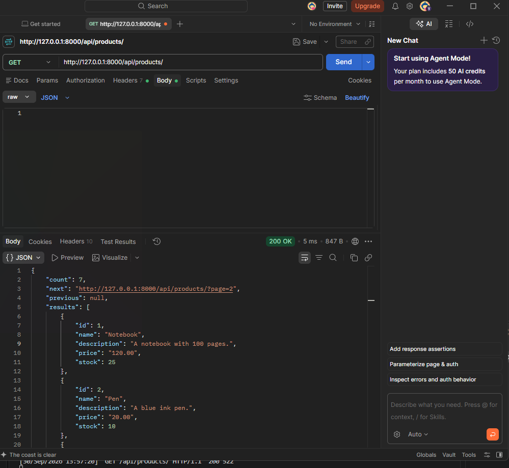
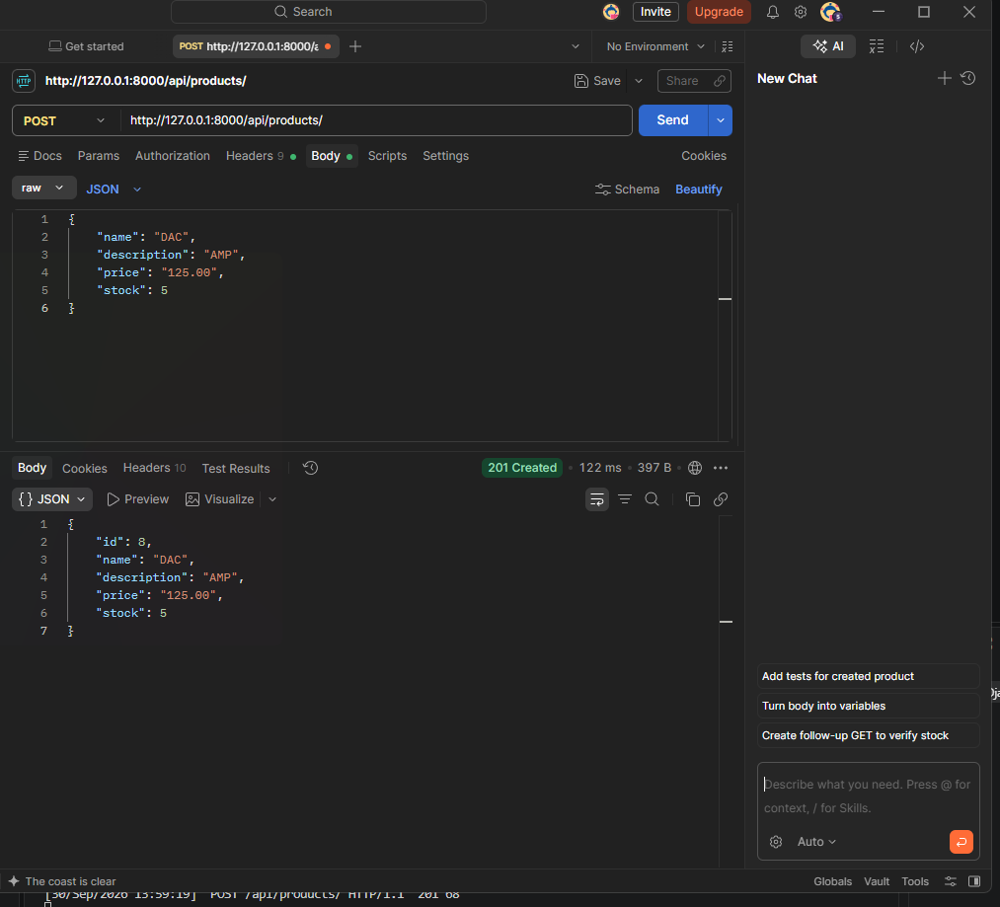
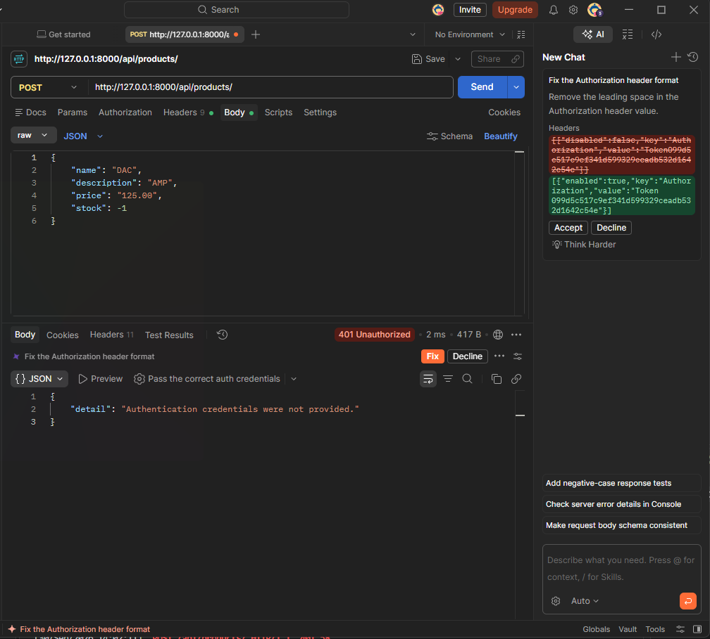
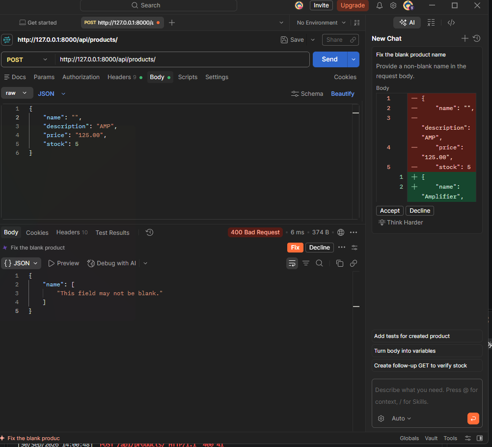
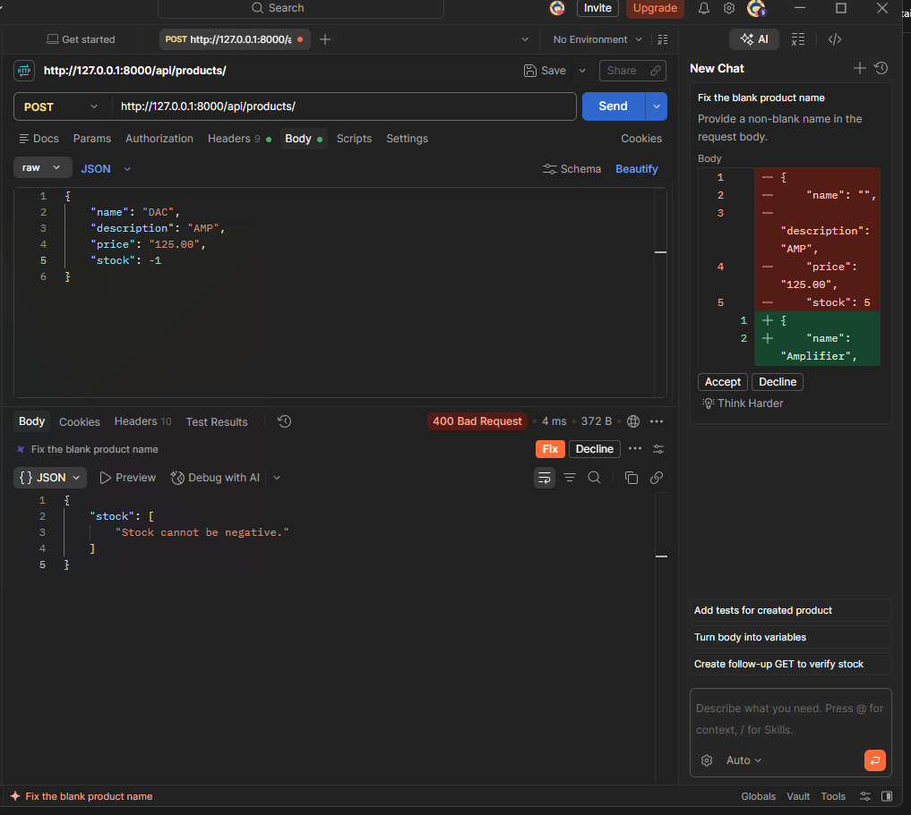
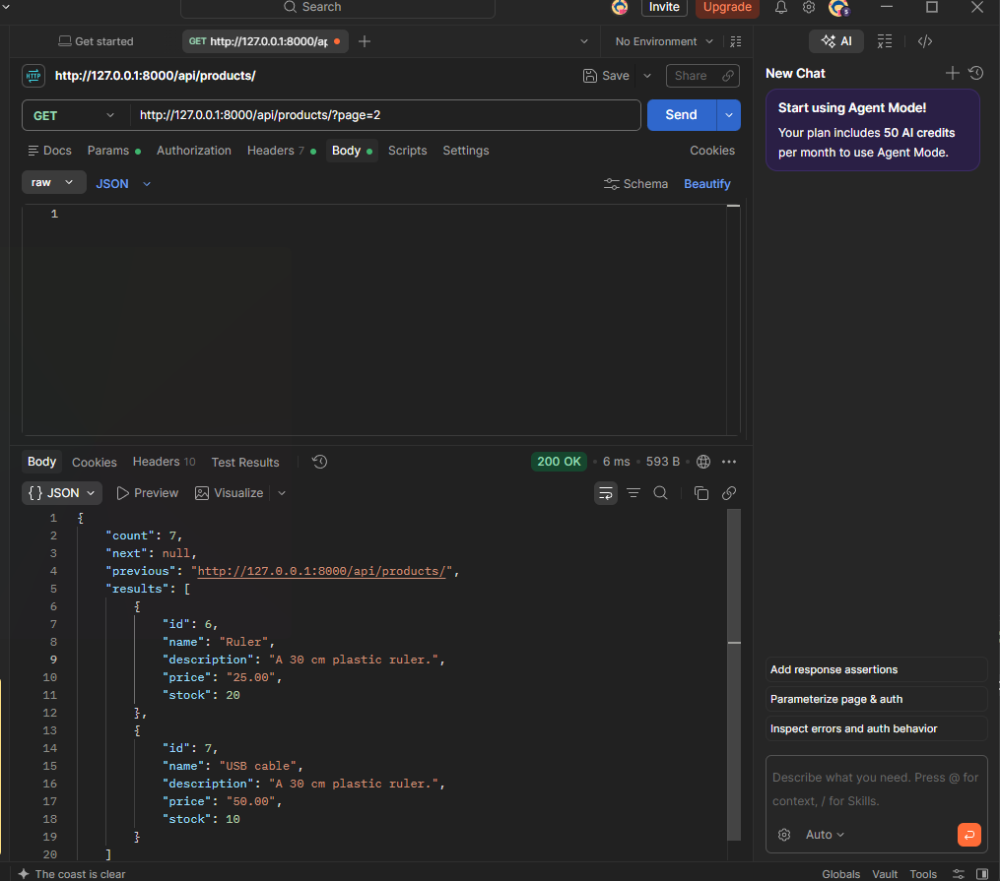

# Simple Product API

A small online shop API built with **Python, Django, and Django REST Framework**.
Visitors can view products without logging in, but only authenticated users (via token) can add new products.

## Features

- `GET /api/products/` – list products (public, paginated, ordered by `id`)
- `POST /api/products/` – add a product (token required)
- Token authentication using DRF's built-in `TokenAuthentication`
- Validation: name cannot be empty, price must be greater than zero, stock cannot be negative
- SQLite database (Django default)

## Project Structure

```
shop_project/
├── manage.py
├── shop_project/      # project settings and root URLs
├── products/          # app: model, serializer, views, urls
└── screenshots/       # test screenshots used in this README
```

## Installation

### 1. Clone the repository

```bash
git clone https://github.com/adam-61/Django-Product-API
cd Django-Product-API
```

### 2. Create and activate a virtual environment

```bash
python -m venv venv

# Windows
venv\Scripts\activate

# macOS / Linux
source venv/bin/activate
```

### 3. Install dependencies

```bash
pip install django djangorestframework
```

(or `pip install -r requirements.txt`)

### 4. Run migrations

```bash
python manage.py makemigrations
python manage.py migrate
```

### 5. Start the server

```bash
python manage.py runserver
```

The API will be available at `http://127.0.0.1:8000/api/products/`.

## Create a Test User and Token

### 1. Create a user

```bash
python manage.py createsuperuser
```

Or create a normal user from the Django shell:

```bash
python manage.py shell
```

```python
from django.contrib.auth.models import User
User.objects.create_user(username="testuser", password="testpass123")
```

### 2. Generate a token

```python
from django.contrib.auth.models import User
from rest_framework.authtoken.models import Token

user = User.objects.get(username="testuser")
token, created = Token.objects.get_or_create(user=user)
print(token.key)
```

Copy the printed token. You will use it in the `Authorization` header for POST requests.

## API Usage

### View products (no token needed)

```
GET /api/products/
```

### Add a product (token required)

```
POST /api/products/
Authorization: Token YOUR_TOKEN
Content-Type: application/json
```

Body:

```json
{
  "name": "Notebook",
  "description": "A notebook with 100 pages.",
  "price": "120.00",
  "stock": 25
}
```

Replace `YOUR_TOKEN` with your test user's token.

## Test Results

### 1. View products without a token

`GET /api/products/` returns the product list.



### 2. Add a valid product with a valid token

`POST /api/products/` returns `201 Created` with the saved product and its generated `id`.



### 3. Add a product without a token (authentication error)

The request is denied because no valid token was provided.



### 4. Add a product with an empty name (validation error)

A validation error is returned for the `name` field.



### 5. Add a product with negative stock (validation error)

A validation error is returned for the `stock` field.



### 6. Pagination – page two after adding six products

`GET /api/products/?page=2` shows the sixth product.



## Tech Stack

- Python 3
- Django
- Django REST Framework
- SQLite

